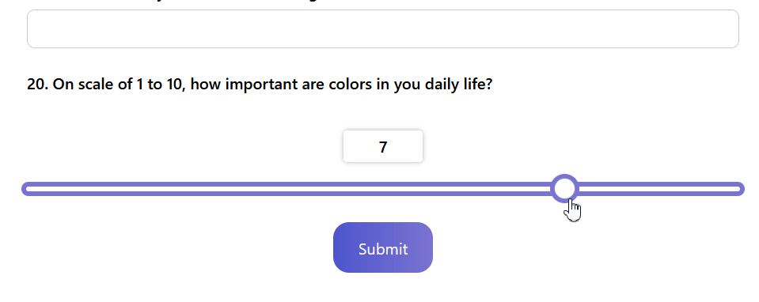
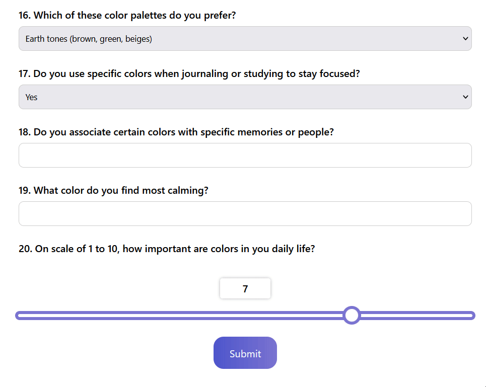
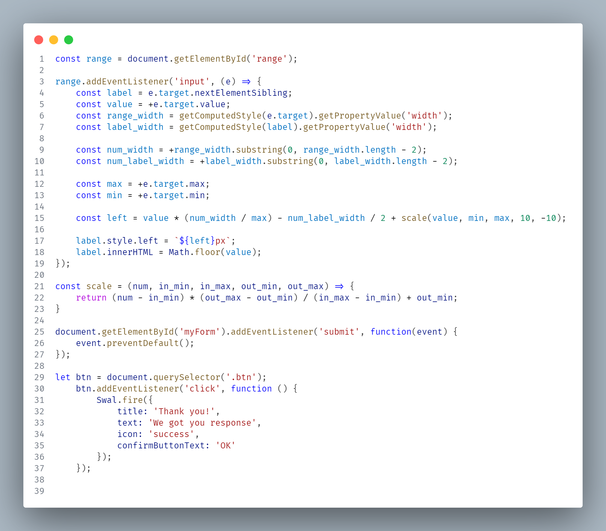

# Survey Form


*Added range slider for rating*


*Added an alert box for submit button*


*JavaScript code*

## JavaScript Features

### Features
1. **Dynamic Range Slider Label**
   * Updates the label position and value in real-time as slider moves
   * Uses `scale()` to fine-tune positioning
2. **Form Submission Handling**
   * Prevents default form submission `event.preventDefault()`
   * Shows a [**SweetAlert**](https://sweetalert2.github.io/) popup on button click

### Key JavaScript Functions
1. `range.addEventListener('input', ...)`
   * **Purpose**: Adjust the label position and value as the slider moves
   * **Calculation**:
      * Gets slider & label width in pixels
      * Converts string widths `300px` to number `300`
      * Computes the label's `left` position based on slider value
      * Updates label text with the current slider value
2. `scale(num, in_min, in_max, out_min, out_max)`
   * **Purpose**: Maps a number from one range to another
   * **Example**:
  
      ```
      scale(50, 0, 100, 10, -10) // Output: 0 (midpoint adjustment)
      ```
   * Used to fine-tune label positioning
3. **Form Submission Handling**
   * Prevents page reload on form submission
   * Shows a success popup using [**SweetAlert**](https://sweetalert2.github.io/)

> [!NOTE]
> The survey page can be access [**here**](https://mal49.github.io/Color-Survey-Form/) and the code can be access in [**Github**](https://github.com/mal49/Color-Survey-Form)
